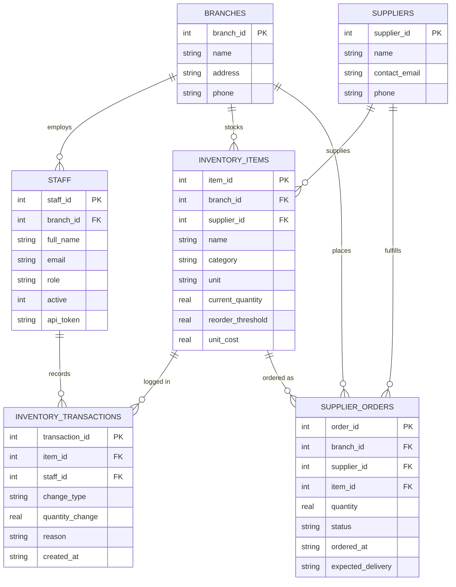

# Copperleaf Kitchens — Inventory MCP Server

## Company & Problem

Copperleaf Kitchens is a restaurant chain with multiple branches. Staff need to
check stock levels, supplier orders, and transaction history; managers need to
write off spoiled/damaged inventory and generate waste reports. The only
alternative to this would be giving an AI assistant raw SQL or shell access to
the production database — no validation, no authorization, no audit trail
beyond whatever the model happened to run. A single bad write-off (wrong item,
wrong quantity, or a prompt injection asserting a false identity) has real
financial consequences.

This project builds an MCP server that sits in front of the database and
exposes only a small, well-defined set of business operations — never raw
SQL — so an AI assistant can help with inventory work without ever touching
the database directly.

## Database

**Engine: SQLite.** Zero setup overhead, a single portable file
(`copperleaf.db`), no separate server process to install or configure. Schema
is in `db/schema.sql`, seed data in `db/seed.sql`.

### ERD

Source file: [db/ERD.mmd](db/ERD.mmd)



`role` is constrained to `staff | manager`; `change_type` to
`restock | write_off | usage | adjustment`; `status` to
`pending | delivered | cancelled` — enforced via `CHECK` constraints in
`schema.sql`. `inventory_transactions` also enforces that `quantity_change`'s
sign matches `change_type` (restocks positive, write-offs/usage negative),
and `supplier_orders.branch_id` is enforced to match the referenced item's
actual branch via triggers, since SQLite `CHECK` constraints can't do
cross-table subqueries.

## Design Decisions

- **Identity is never a tool argument.** `write_off_inventory` doesn't accept
  `staff_id` as a parameter — a model (or an injected prompt) could just
  assert any identity it wanted. A client authenticates the session with
  `staff.api_token` on connect, and every tool call resolves identity/role
  from that session server-side.
- **Write-offs are branch-scoped.** A manager can only write off inventory
  belonging to their own branch (`staff.branch_id == inventory_items.branch_id`),
  checked explicitly in the handler.
- **`write_off_inventory` updates two tables atomically** — the transaction
  log insert and the stock quantity update happen in a single DB transaction,
  so a mid-operation failure can't desync them.
- **High-cost write-offs pause for human confirmation via elicitation.** Risk
  on `write_off_inventory` is handled by JSON Schema constraints, independent
  server-side validation, handler-level authorization, and — above a cost
  threshold — an explicit human sign-off before the write-off completes.
- **Seed data's starting `current_quantity` values are unlogged** — they
  represent stock level when the system went live, not the sum of
  transaction rows. Everything after that point is fully audited.
- **Seed tokens are obviously fake** (`FAKE_NOT_REAL_TOKEN_mona_001` etc.) —
  not realistic-looking placeholders, since those can get flagged as real
  credentials by scanners even when nothing's actually at risk.

## Protocol Concerns

| Concern | Status |
|---|---|
| Capability negotiation | Done — server declares sampling, elicitation, and resources support in `initialize`; client checks each before relying on it |
| Notifications | Done — `tools/list_changed` pushed when an item crosses its reorder threshold |
| Elicitation | Done — `elicitation/create` gate on high-cost write-offs |
| Resources | Done — waste policy exposed via `resources/read` |
| Prompts | Done — parameterized waste-explanation template |
| Sampling | Done — `generate_waste_report`'s AI summary, gated on a real capability check |
| Transport (stdio) | stdio only — sufficient for a single-clinic/branch demo session; Streamable HTTP would be needed for true multi-client concurrency, noted as a TODO in auth.py |
| Progress tracking | Done — `generate_waste_report`'s staged `ctx.report_progress` calls |
| Defensive tool design | Done — `validation.py`, handler-level auth + branch scoping, atomic write in `get_write_connection` |

## Project Structure

```
copperleaf-mcp/
├── db/
│   ├── schema.sql
│   ├── seed.sql
│   └── ERD.mmd
├── tests/
│   ├── test_protocol_concerns.py
│   └── test_output.log     
├── mcp_server/
│   ├── server.py
│   ├── auth.py
│   ├── db.py
│   ├── tools.py
│   ├── validation.py
│   ├── resources.py
│   ├── prompts.py
│   └── init_db.py
├── agent/
│   └── client.py
├── .env.example
├── .gitignore
├── requirements.txt
└── README.md
```

## Team

Built by a three-person team. Work split across `db/`, `mcp_server/`, and
`agent/`, and across the eight protocol concerns above, with one owner per
concern.

## Session 3 — Memory & RAG

### The problem, on top of the existing system

Copperleaf Kitchens' MCP server (Session 2) already lets staff query
inventory, write off waste, and generate reports — but it has no memory
across sessions, and no way to answer questions from anything outside the
database.

**Memory gap:** Managers across shifts and branches have no persistent
visibility into *recurring* problems. Each write-off is logged individually
in `inventory_transactions`, but nothing surfaces the pattern across
sessions — a manager re-discovers "Nile Fresh keeps delivering late" from
scratch every time instead of the system already knowing it.

**Knowledge gap:** Food-safety storage requirements, supplier contract
terms (delivery windows, quality guarantees, damaged-goods return policy),
and shelf-life guidance live only in documents the database was never built
to answer questions from (`rag/corpus/`). This is the RAG corpus.

Real stakes: a systemic supplier problem or a mishandled storage rule going
unaddressed costs real, recurring money — the same financial-stakes basis
argued in the Session 2 README.

### Extending the existing system

This builds directly on the Session 2 `mcp_server/` and `db/` — no
database or server logic is duplicated. `memory/` and `rag/` are new,
additive modules that read from the same `copperleaf.db` and reuse the
same domain (branches, suppliers, items, write-offs) already established.

### Context window management

**Test setup:** a 39-turn transcript where a critical food-safety fact
(Prime Ribeye failing its temperature check at receiving) is mentioned
once early in the conversation, then buried under 26+ turns of realistic
tool-output noise (routine inventory checks across other items and
branches) before a final question ("is there anything I should flag for
a food-safety review?") that can only be answered correctly if the fact
survived. See `context_eval/transcript.py`.

| Strategy | Fact recalled correctly | Est. tokens | Latency |
|---|---|---|---|
| Sliding window (last 10 turns) | No | ~365 | 0.00s |
| Observation masking (last 3 tool outputs) | Yes | ~588 | 0.00s |
| Zone-based pruning (4 zones) | Yes | ~1040 | 0.00s |
| Recursive summarization (compact every 10 turns) | Yes | ~426 | 4.62s |

**We ship recursive summarization.** Sliding window is the cheapest
strategy by token count, but it fails the one thing that actually matters
for Copperleaf: it drops the food-safety fact entirely once it falls
outside the last 10 turns, which is disqualifying regardless of cost.
Among the three strategies that preserved the fact, recursive
summarization used the fewest tokens (~426, vs. 588 for observation
masking and 1040 for zone-based pruning) — meaningfully cheaper than
zone-based pruning because it actually compresses older turns instead of
just truncating them, while still keeping the specific supplier/item/date
details intact by explicit prompt instruction (see
`context_eval/strategies_llm.py`).

The trade-off is latency: recursive summarization takes real API calls
(4.62s for this test case, 3 summarization rounds), while the other three
strategies are effectively instant since they're pure text manipulation.
For Copperleaf's actual use case — a manager reviewing recurring
write-off patterns, not a live phone call waiting on an answer — a few
seconds of latency is an acceptable trade for materially better token
economics and full fact preservation. (This differs from the lab's own
worked example, where Larkspur Veterinary picked observation masking
specifically because their failure mode was live phone calls where
latency was the dominant constraint — a genuinely different query pattern
than ours.)

Full test harness and real output: `context_eval/run_comparison.py`,
`context_eval/run_comparison_output.log`.

