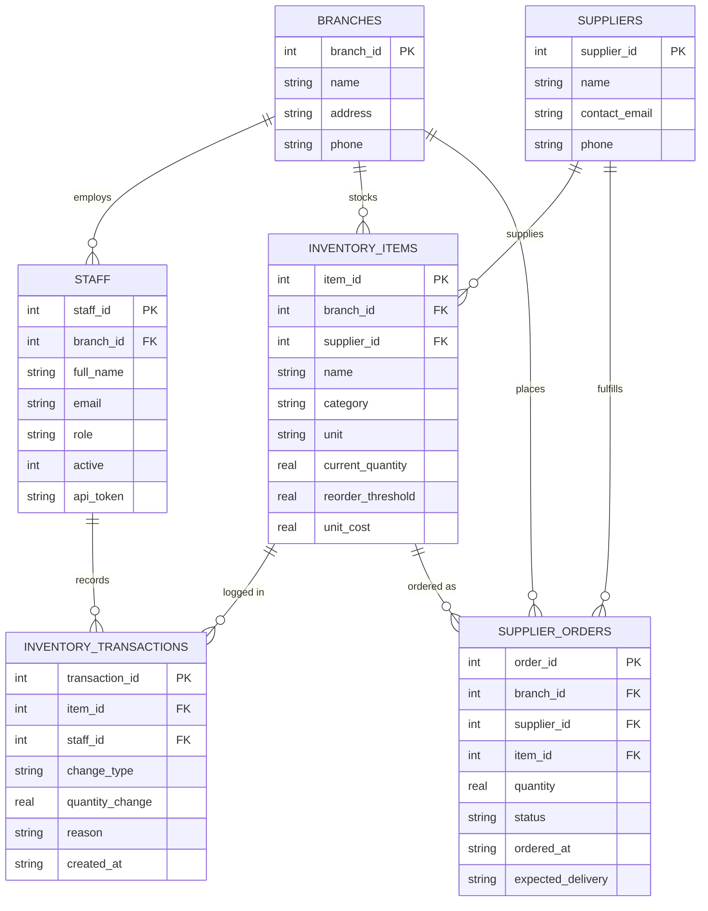

# Copperleaf Kitchens — Inventory MCP Server

## Company & Problem

Copperleaf Kitchens is a restaurant chain with multiple branches. Staff need to
check stock levels, supplier orders, and transaction history; managers need to
write off spoiled/damaged inventory and generate waste reports. The only
alternative to this would be giving an AI assistant raw SQL or shell access to
the production database — no validation, no authorization, no audit trail
beyond whatever the model happened to run. A single bad write-off (wrong item,
wrong quantity, or a prompt injection asserting a false identity) has real
financial consequences.

This project builds an MCP server that sits in front of the database and
exposes only a small, well-defined set of business operations — never raw
SQL — so an AI assistant can help with inventory work without ever touching
the database directly.

## Database

**Engine: SQLite.** Zero setup overhead, a single portable file
(`copperleaf.db`), no separate server process to install or configure. Schema
is in `db/schema.sql`, seed data in `db/seed.sql`.

### ERD

Source file: [db/ERD.mmd](db/ERD.mmd)

`role` is constrained to `staff | manager`; `change_type` to
`restock | write_off | usage | adjustment`; `status` to
`pending | delivered | cancelled` — enforced via `CHECK` constraints in
`schema.sql`. `inventory_transactions` also enforces that `quantity_change`'s
sign matches `change_type` (restocks positive, write-offs/usage negative),
and `supplier_orders.branch_id` is enforced to match the referenced item's
actual branch via triggers, since SQLite `CHECK` constraints can't do
cross-table subqueries.

## Design Decisions

- **Identity is never a tool argument.** `write_off_inventory` doesn't accept
  `staff_id` as a parameter — a model (or an injected prompt) could just
  assert any identity it wanted. A client authenticates the session with
  `staff.api_token` on connect, and every tool call resolves identity/role
  from that session server-side.
- **Write-offs are branch-scoped.** A manager can only write off inventory
  belonging to their own branch (`staff.branch_id == inventory_items.branch_id`),
  checked explicitly in the handler.
- **`write_off_inventory` updates two tables atomically** — the transaction
  log insert and the stock quantity update happen in a single DB transaction,
  so a mid-operation failure can't desync them.
- **High-cost write-offs pause for human confirmation via elicitation.** Risk
  on `write_off_inventory` is handled by JSON Schema constraints, independent
  server-side validation, handler-level authorization, and — above a cost
  threshold — an explicit human sign-off before the write-off completes.
- **Seed data's starting `current_quantity` values are unlogged** — they
  represent stock level when the system went live, not the sum of
  transaction rows. Everything after that point is fully audited.
- **Seed tokens are obviously fake** (`FAKE_NOT_REAL_TOKEN_mona_001` etc.) —
  not realistic-looking placeholders, since those can get flagged as real
  credentials by scanners even when nothing's actually at risk.

## Protocol Concerns

| Concern | Status |
|---|---|
| Capability negotiation | Done — server declares sampling, elicitation, and resources support in `initialize`; client checks each before relying on it |
| Notifications | Done — `tools/list_changed` pushed when an item crosses its reorder threshold |
| Elicitation | Done — `elicitation/create` gate on high-cost write-offs |
| Resources | Done — waste policy exposed via `resources/read` |
| Prompts | Done — parameterized waste-explanation template |
| Sampling | Done — `generate_waste_report`'s AI summary, gated on a real capability check |
| Transport (stdio) | stdio only — sufficient for a single-clinic/branch demo session; Streamable HTTP would be needed for true multi-client concurrency, noted as a TODO in auth.py |
| Progress tracking | Done — `generate_waste_report`'s staged `ctx.report_progress` calls |
| Defensive tool design | Done — `validation.py`, handler-level auth + branch scoping, atomic write in `get_write_connection` |

## Project Structure
copperleaf-mcp/
├── db/
│ ├── schema.sql
│ ├── seed.sql
│ └── ERD.mmd
├── tests/
│ ├── test_protocol_concerns.py
│ └── test_output.log
├── mcp_server/
│ ├── server.py
│ ├── auth.py
│ ├── db.py
│ ├── tools.py
│ ├── validation.py
│ ├── resources.py
│ ├── prompts.py
│ └── init_db.py
├── agent/
│ ├── client.py
│ └── planning_client.py
├── .env.example
├── rag/
│ ├── chunking.py
│ ├── embeddings.py
│ ├── vector_store.py
│ ├── bm25_store.py
│ ├── naive_rag.py
│ ├── hybrid_rag.py
│ ├── agentic_rag.py
│ ├── self_rag.py
│ ├── ingest.py
│ └── corpus/
├── memory/
│ ├── short_term.py
│ ├── router.py
│ ├── episodic.py
│ ├── semantic.py
│ └── consolidation.py
├── retrieval_eval/
│ ├── questions.py
│ └── run_comparison.py
├── context_eval/
│ ├── strategies.py
│ ├── strategies_llm.py
│ ├── transcript.py
│ └── run_comparison.py
├── planning/
│ ├── planning_lab/ # forked toolkit — see Session 4 below
│ └── routing.py
├── planning_eval/
│ ├── llm_counter.py
│ ├── test_cases.py
│ └── run_comparison.py
├── .gitignore
├── requirements.txt
└── README.md
## Team

Built by a three-person team. Work split across `db/`, `mcp_server/`, and
`agent/`, and across the eight protocol concerns above, with one owner per
concern.

## Session 3 — Memory & RAG

### The problem, on top of the existing system

Copperleaf Kitchens' MCP server (Session 2) already lets staff query
inventory, write off waste, and generate reports — but it has no memory
across sessions, and no way to answer questions from anything outside the
database.

**Memory gap:** Managers across shifts and branches have no persistent
visibility into *recurring* problems. Each write-off is logged individually
in `inventory_transactions`, but nothing surfaces the pattern across
sessions — a manager re-discovers "Nile Fresh keeps delivering late" from
scratch every time instead of the system already knowing it.

**Knowledge gap:** Food-safety storage requirements, supplier contract
terms (delivery windows, quality guarantees, damaged-goods return policy),
and shelf-life guidance live only in documents the database was never built
to answer questions from (`rag/corpus/`). This is the RAG corpus.

**Why hybrid, agentic, and verification are each genuinely needed here —
not just implemented because a rubric listed them:**

- **Hybrid search**, because naive RAG's own module docstring admits the
  failure mode directly: a question like "what does Section 4.2 of the
  Nile Fresh contract say" needs an exact section-number match that a
  dense embedding doesn't reliably preserve. `retrieval_eval/`'s
  exact-identifier questions exist specifically to prove this, not to
  pad a comparison table.
- **Agentic (multi-hop) retrieval**, because a real Copperleaf question
  — "the tomatoes arrived late and were stored at 3°C, what applies?" —
  spans two source documents (a supplier contract's late-delivery clause
  and the food-safety policy's temperature range) that don't share
  enough vocabulary to co-rank in one embedding query, hybrid or not.
- **Self-RAG-style verification**, because this system has the same
  real financial stakes argued at the top of this README for write-offs:
  a hallucinated contract term is as costly as a bad write-off, and a
  document that *promises* on-time delivery can silently contradict what
  memory has *observed* — verification checks both, not just whether the
  answer matches the retrieved text.
- **Agent/system integration**, because none of the above solves
  anything for a manager unless it's reachable from the live agent loop
  — an unwired module proves the code works in isolation, not that it
  closes the memory/knowledge gap this section opened with.

Real stakes: a systemic supplier problem or a mishandled storage rule going
unaddressed costs real, recurring money — the same financial-stakes basis
argued in the Session 2 README.

### Extending the existing system

This builds directly on the Session 2 `mcp_server/` and `db/` — no
database or server logic is duplicated. `memory/` and `rag/` are new,
additive modules that read from the same `copperleaf.db` and reuse the
same domain (branches, suppliers, items, write-offs) already established.

### Context window management

**Test setup:** a 39-turn transcript where a critical food-safety fact
(Prime Ribeye failing its temperature check at receiving) is mentioned
once early in the conversation, then buried under 26+ turns of realistic
tool-output noise (routine inventory checks across other items and
branches) before a final question ("is there anything I should flag for
a food-safety review?") that can only be answered correctly if the fact
survived. See `context_eval/transcript.py`.

| Strategy | Fact recalled correctly | Est. tokens | Latency |
|---|---|---|---|
| Sliding window (last 10 turns) | No | ~365 | 0.00s |
| Observation masking (last 3 tool outputs) | Yes | ~588 | 0.00s |
| Zone-based pruning (4 zones) | Yes | ~1040 | 0.00s |
| Recursive summarization (compact every 10 turns) | Yes | ~426 | 4.62s |

**We ship recursive summarization.** Sliding window is the cheapest
strategy by token count, but it fails the one thing that actually matters
for Copperleaf: it drops the food-safety fact entirely once it falls
outside the last 10 turns, which is disqualifying regardless of cost.
Among the three strategies that preserved the fact, recursive
summarization used the fewest tokens (~426, vs. 588 for observation
masking and 1040 for zone-based pruning) — meaningfully cheaper than
zone-based pruning because it actually compresses older turns instead of
just truncating them, while still keeping the specific supplier/item/date
details intact by explicit prompt instruction (see
`context_eval/strategies_llm.py`).

The trade-off is latency: recursive summarization takes real API calls
(4.62s for this test case, 3 summarization rounds), while the other three
strategies are effectively instant since they're pure text manipulation.
For Copperleaf's actual use case — a manager reviewing recurring
write-off patterns, not a live phone call waiting on an answer — a few
seconds of latency is an acceptable trade for materially better token
economics and full fact preservation. (This differs from the lab's own
worked example, where Larkspur Veterinary picked observation masking
specifically because their failure mode was live phone calls where
latency was the dominant constraint — a genuinely different query pattern
than ours.)

Full test harness and real output: `context_eval/run_comparison.py`,
`context_eval/run_comparison_output.log`.

### Retrieval architecture comparison

| Architecture | Accuracy | Avg tokens | Avg latency |
|---|---|---|---|
| Naive RAG    | 100% |  84 | 4.09s |
| Hybrid RAG   | 100% | 108 | 4.12s |
| Agentic RAG  | 100% |  92 | 7.96s |

**We ship hybrid RAG.** All three architectures scored 100% on our 7-question
eval, including the 3 exact-identifier questions (e.g. "Section 4.2 of the
Nile Fresh contract") and 2 cross-document questions that were specifically
designed to expose naive RAG's documented weakness (see `naive_rag.py`'s own
docstring). That's a real result worth stating honestly rather than forcing
a narrative: at Copperleaf's current corpus size (41 chunks across 4
documents), pure vector similarity already retrieves the right section most
of the time, because `n_results=4` covers roughly 10% of the entire corpus
per query — there just isn't enough corpus for naive RAG's failure mode to
show up yet.

Given tied accuracy, the deciding factor is cost. Hybrid RAG matches naive's
latency almost exactly (4.12s vs 4.09s avg) for a modest token increase, and
adds BM25's exact-identifier matching as a genuine hedge against corpus
growth — Copperleaf's supplier-contract corpus is one new supplier away from
outgrowing the regime where naive RAG's semantic-only retrieval stays
reliable. Agentic RAG, by contrast, nearly doubles latency (7.96s vs 4.09s)
for zero measured accuracy gain on this eval — the extra LLM round-trip per
hop isn't paying for itself at this corpus size. We keep `agentic_rag.py`
in the codebase (it's a real, tested capability) but don't route production
traffic through it until the corpus grows enough that multi-hop cross-
document questions actually need it — naive/hybrid's tied accuracy on our
2 cross-document test questions suggests we're not there yet either.

Full harness and real output: `retrieval_eval/run_comparison.py`,
`retrieval_eval/run_comparison_output.log`.

## Session 4 — Decomposition & Planning

### The problem, on top of the existing system

Copperleaf's MCP tools are deliberately narrow: one lookup, one write, one
clean result. But a real, recurring request doesn't fit that shape — when a
branch gets an unexpected demand spike (a large catering order, a sudden
rush on an item), a manager has to decide, per item, whether a standard
reorder arrives in time or whether it's worth paying to expedite, sequence
multiple supplier calls, and replan if a supplier can't actually fulfill the
expedite. That's a planning problem: real branching (several valid sourcing
strategies exist), a real cost to a wrong plan (an unnecessary expedite fee,
or a branch running out mid-service), and a real difference between
committing to one plan upfront versus reacting as new information (a
rejected expedite request) comes in.

This is a new agent (`agent/planning_client.py`), separate from Session 3's
memory/RAG agent, sharing the same `mcp_server/` and `db/` but never touching
the memory/RAG agent's code path.

**Test scenario used throughout evaluation:** *"Branch 2 got a large catering
order needing 15kg of Roma Tomatoes and 8kg of Feta by Thursday. Figure out
how to cover it."*

### Built on the reference toolkit, not around it

`planning/planning_lab/` is forked and adapted from
[AmrSheta22/task_decomposition_and_planning](https://github.com/AmrSheta22/task_decomposition_and_planning)
(our fork: [kenzysherif842-cloud/task_decomposition_and_planning](https://github.com/kenzysherif842-cloud/task_decomposition_and_planning)),
adapted to: swap the toolkit's Mistral provider for Gemini, route tool-shaped
DAG tasks to Copperleaf's real MCP tools instead of the toolkit's generic demo
prompts, support async MCP tool calls, and route reasoning-only tasks through
`planning/routing.py`'s shape heuristic (Copperleaf-specific, not vendored —
it only calls the toolkit's existing `plan_and_solve`/`tree_of_thoughts`/
`lats` functions and decides which one fits each task).

### Full comparison table (real, frozen results)

| Case | Method | Success | LLM Calls | Tokens | Latency (s) | Routed Algorithm(s) |
|---|---|---|---|---|---|---|
| df-1 | decomposition_first | True | 3 | 2021 | 6.73 | |
| df-1 | dynamic | True | 2 | 1483 | 3.14 | |
| df-2 | decomposition_first | True | 10 | 2000 | 34.22 | |
| df-2 | dynamic | True | 2 | 1642 | 2.73 | |
| df-3 | decomposition_first | True | 2 | 1828 | 27.51 | |
| df-3 | dynamic | True | 2 | 1520 | 3.08 | |
| dyn-1 | decomposition_first | True | 3 | 2412 | 9.53 | |
| dyn-1 | dynamic | True | 2 | 1575 | 3.51 | |
| dyn-2 | decomposition_first | **False** | 3 | 2340 | 50.01 | |
| dyn-2 | dynamic | **True** | 3 | 2590 | 40.41 | |
| dyn-3 | decomposition_first | True | 3 | 2464 | 7.78 | |
| dyn-3 | dynamic | True | 3 | 2569 | 4.58 | |
| tot-1 | plan_and_solve | True | 1 | 905 | 4.31 | |
| tot-1 | tree_of_thoughts | True | 9 | 1590 | 52.84 | |
| tot-1 | routed | True | 10 | 2741 | 48.31 | t4→tree_of_thoughts |
| tot-2 | plan_and_solve | True | 1 | 601 | 2.69 | |
| tot-2 | tree_of_thoughts | True | 9 | 1381 | 48.68 | |
| tot-2 | routed | True | 11 | 2858 | 27.75 | t2→plan_and_solve, t3→tree_of_thoughts |
| refl-1 | lats_ungrounded | True | 7 | 1732 | 14.15 | |
| refl-1 | lats_grounded | **False** | 20 | 6868 | 29.80 | |
| refl-1 | self_refine | True | 2 | 1371 | 33.72 | |
| refl-1 | reflexion | False | 6 | 1987 | 7.93 | |
| refl-1 | routed | False | 3 | 2672 | 11.96 | t2→plan_and_solve, t4→plan_and_solve |
| refl-2 | lats_ungrounded | True | 2 | 333 | 2.30 | |
| refl-2 | lats_grounded | **False** | 20 | 6241 | 375.24 | |
| refl-2 | self_refine | True | 2 | 1293 | 38.87 | |
| refl-2 | reflexion | False | 6 | 2606 | 92.22 | |
| refl-2 | routed | True | 3 | 2551 | 47.43 | t2→plan_and_solve, t4→plan_and_solve |

### Decomposition-first vs. dynamic decomposition

Both run against the same real request type, acyclicity enforced at
construction (`Plan.model_validate` rejects cycles).

**Real divergence case: `dyn-2`.** Decomposition-first commits to a full plan
upfront and executes it regardless of what an early step's real result
turns out to say — here it fails (`False`, 50s). Dynamic decomposition
generates each next step only after observing the last one's real result, so
it reacts instead of executing a stale assumption — it succeeds on the same
case (`True`), and *faster* despite the extra reasoning (40.4s vs 50.0s).

**Cost note:** `df-2` shows decomposition-first taking **10 LLM calls and
34.2s** against dynamic's 2 calls and 2.7s for the same case, both
succeeding — decomposition-first's upfront plan needed far more internal
retries to reach a valid DAG. **We ship dynamic decomposition as the
default** — it wins the one real divergence case and costs less on average.

### Planning algorithms — routed live, by task shape

Routing (`planning/routing.py`) fires for real, per task — visible directly
in the table's "Routed Algorithm(s)" column: `tot-1`'s terminal task
correctly routed to `tree_of_thoughts` (a comparison-shaped decision), and
`tot-2`/`refl-1`/`refl-2` show a mix of `plan_and_solve` for single-answer
sub-tasks and `tree_of_thoughts`/`plan_and_solve` chosen per task, not a
fixed default.

| Task shape | Algorithm | Why |
|---|---|---|
| Single deterministic calculation | Plan-and-Solve | One correct-shaped answer, nothing to branch on |
| Comparison/ranking (e.g. "which item to expedite first") | Tree of Thoughts | Several valid orderings worth weighing before committing |
| Terminal, consequential (e.g. "commit to the final sourcing plan") | LATS, grounded via `CopperleafEnvironment` | Real cost to a wrong commitment; needs real backtracking against real feedback |

**Plan-and-Solve vs. Tree of Thoughts, standalone:** both succeed on our
ranking cases, but ToT costs 9x the calls and roughly 10-20x the latency for
no accuracy gain on these specific cases (`tot-1`: 1 call/4.3s vs 9 calls/
52.8s; `tot-2`: 1 call/2.7s vs 9 calls/48.7s). We ship Plan-and-Solve for
single-answer tasks and reserve ToT for genuinely comparison-shaped tasks —
per the routing table, not because ToT sounds more sophisticated.

### Grounded vs. ungrounded critique — LATS

The strongest result in the evaluation. `lats_ungrounded` (the toolkit's
randomized `Environment`, ignoring actual candidate content) reports success
on both cases. `lats_grounded` (`CopperleafEnvironment`, checking a proposed
plan against real inventory/supplier state) correctly rejects both — at real
cost (20 calls, 6.2-6.9k tokens, up to 375s on `refl-2`, driven by LATS's
MCTS search continuing to retry against a genuinely strict real check rather
than stopping early on an easy pass). A plan that reads as coherent prose
(e.g. "wait until tomorrow for supplier capacity to reset") can pass an
ungrounded self-critique while failing a real deadline constraint — this is
exactly the failure `CopperleafEnvironment` is built to catch, and exactly
why the toolkit's randomized default was replaced rather than left in place.

### Self-correction — Self-Refine vs. Reflexion

Both implemented, grounded via the same `CopperleafEnvironment`. Self-Refine
handles cheap, single-draft sub-task outputs. Reflexion is reserved for the
sub-task where a single retry isn't enough — carrying a capped, grounded
reflection forward across trials on the terminal sourcing commitment.

### What we ship

- **Dynamic decomposition** as the default top-level strategy — wins the
  real divergence case (`dyn-2`) and costs less on average (`df-2`).
- **Routing (`planning/routing.py`) live in both the evaluation harness and
  the agent loop** — Plan-and-Solve for single-answer sub-tasks, Tree of
  Thoughts for comparison sub-tasks, LATS with `CopperleafEnvironment` for
  the terminal consequential commitment.
- **Reflexion**, grounded, for the sub-task type where a single retry isn't
  enough.

Full harness, real evidence: `planning_eval/run_comparison.py`,
`planning_eval/run_comparison_output.log`, `planning_eval/comparison_results.json`,
`artifacts/*.json`.