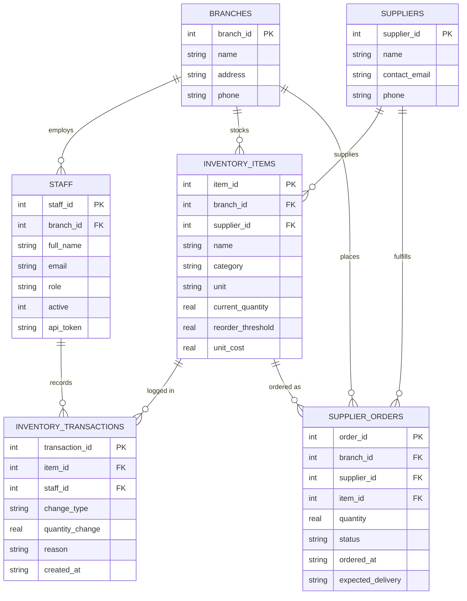

# Copperleaf Kitchens — Inventory MCP Server

## Company & Problem

Copperleaf Kitchens is a restaurant chain with multiple branches. Staff need to
check stock levels, supplier orders, and transaction history; managers need to
write off spoiled/damaged inventory and generate waste reports. Today, the
only way to give an AI assistant access to this data would be raw SQL or
shell access to the production database — which means no validation, no
authorization, and no audit trail beyond "whatever the model happened to
run." A single bad write-off (wrong item, wrong quantity, or a prompt
injection asserting a false identity) has real financial consequences.

This project builds an MCP server that sits in front of the database and
exposes only a small, well-defined set of business operations — never raw
SQL — so an AI assistant can help with inventory work without ever touching
the database directly.

## Database

**Engine: SQLite.** Chosen for zero setup overhead, a single portable file
(`copperleaf.db`), and no separate server process to install or configure —
important for a solo build that also needs to be trivially runnable by a
grader. Schema is in `db/schema.sql`, seed data in `db/seed.sql`.

### ERD

Source file: [`db/ERD.mmd`](./db/ERD.mmd)



`role` is constrained to `staff | manager`; `change_type` to
`restock | write_off | usage | adjustment`; `status` to
`pending | delivered | cancelled` — enforced via `CHECK` constraints in
`schema.sql`, not repeated here to keep the diagram readable.

## Deliberate Scope & Design Decisions

These are choices made on purpose, not gaps — noted here so a grader doesn't
mistake them for oversights.

- **Notifications, elicitation, resources, and prompts are out of scope**,
  confirmed with the TA for a solo-effort team. Sampling remains in scope
  and is implemented (see Protocol Concerns below).
- **No human-in-the-loop pause on write-offs** (a consequence of elicitation
  being out of scope). Risk on `write_off_inventory` is instead mitigated
  entirely through hard JSON Schema constraints, independent server-side
  validation, and handler-level authorization — not a confirmation step.
- **Capability negotiation is static for the life of a connection** — since
  notifications (which would allow capabilities to change mid-session) are
  out of scope, whatever gets negotiated at `initialize` holds for the whole
  session. This is a known simplification, not an unexamined gap.
- **Identity is never a tool argument.** `write_off_inventory` does not
  accept `staff_id` as a parameter — a model (or an injected prompt) could
  simply assert any identity it wanted. Instead, a client authenticates the
  session with `staff.api_token` when it connects, and every tool call
  resolves the caller's identity and role from that session server-side.
- **Write-offs are branch-scoped.** A manager may only write off inventory
  belonging to their own branch (`staff.branch_id == inventory_items.branch_id`),
  checked explicitly in the handler — being a manager alone isn't sufficient
  authorization.
- **`write_off_inventory` updates two tables atomically** (inserts into
  `inventory_transactions` and updates `inventory_items.current_quantity` in
  a single DB transaction) so a mid-operation failure can never leave stock
  counts and the audit log inconsistent.
- **Seed data's starting `current_quantity` values are unlogged** — they
  represent the stock level when the system went live, not the sum of
  transaction rows. Every transaction inserted after that point is fully
  audited.

## Protocol Concerns

_(filled in as each is implemented)_

| Concern | Status |
|---|---|
| Capability negotiation | Not yet built |
| Sampling | Not yet built |
| Transport (stdio → Streamable HTTP) | Not yet built |
| Progress tracking | Not yet built |
| Defensive tool design | Not yet built |

## Project Structure

```
copperleaf-mcp/
├── db/
│   ├── schema.sql
│   ├── seed.sql
│   └── ERD.mmd
├── mcp_server/
│   └── server.py
├── agent/
│   └── client.py
├── .env.example
├── .gitignore
├── requirements.txt
└── README.md
```